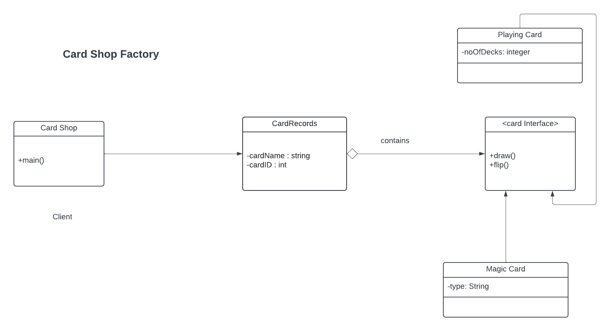

## Problem Scenario
Implement factory design pattern using Card as the factory interface. The interface implements two methods: draw() and flip().

Magic Card and Playing Card are concrete objects that implements card interface.

CardRecord holds attributes such as cardId, cardName, and card.

Card Shop would be the client object.

Refer to the UML Class Diagram

## UML Class Diagram

